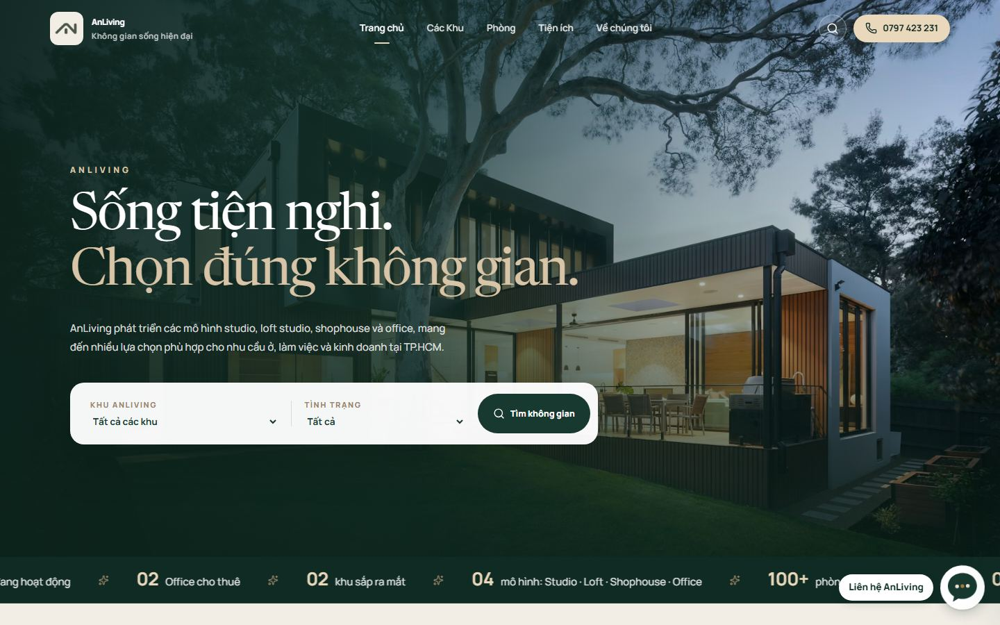
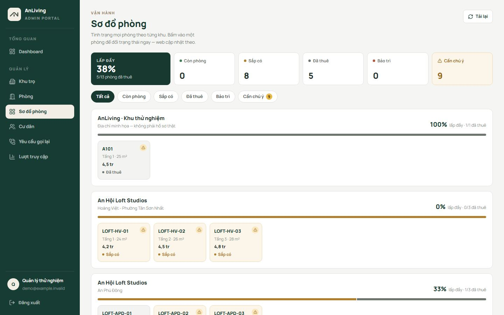
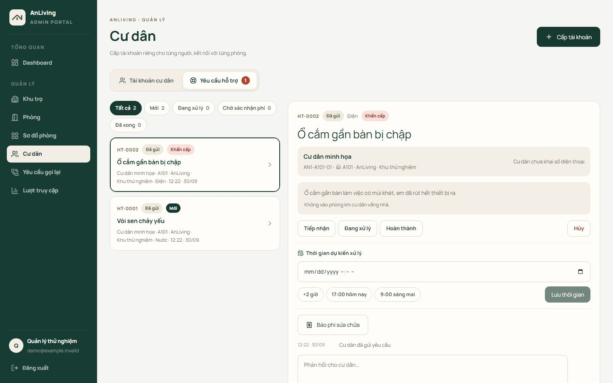

## Chào bạn, mình là Toàn

```
toan@ntoan64
----------------------------------------------------------
Họ tên ............ Nguyễn Thanh Toàn
Sống tại .......... TP. Hồ Chí Minh, Việt Nam
Hướng đi .......... Fullstack Developer
Hay dùng .......... React, JavaScript, Node.js, Express, MongoDB
Triển khai ........ Docker, Cloudflare, Git
Đang học .......... Java, Spring Boot, PostgreSQL
Đang tìm .......... Thực tập Fullstack / Frontend tại TP.HCM
----------------------------------------------------------
Đồ án hiện tại .... AnLiving, web cho thuê phòng (đang hoàn thiện)
Xem web ........... anlivingspaces.com
```

Mình thích làm những thứ có người dùng thật, vì lúc đó mới thấy chỗ nào chưa ổn để sửa.

### Đồ án AnLiving

Web mình làm cho một bên cho thuê phòng ở TP.HCM, đang trong quá trình hoàn thiện, bản hiện tại đã chạy tại [anlivingspaces.com](https://anlivingspaces.com). Khách xem và lọc phòng, chủ nhà quản lý phòng và cư dân, còn người đang thuê thì báo hỏng và theo dõi sửa chữa ngay trên web. Mình làm từ giao diện, backend tới đưa lên Cloudflare.

Giới thiệu chi tiết kèm ảnh: [ntoan64/anliving](https://github.com/ntoan64/anliving)



<table>
<tr>
<td width="50%"></td>
<td width="50%"></td>
</tr>
<tr>
<td>Khách lọc phòng theo giá, diện tích, tiện ích</td>
<td>Chủ nhà xem sơ đồ phòng và đổi trạng thái</td>
</tr>
<tr>
<td> </td>
<td></td>
</tr>
<tr>
<td>Trên điện thoại: trang phòng và trang của cư dân</td>
<td>Xử lý yêu cầu báo hỏng của cư dân</td>
</tr>
</table>

Khi làm mình có dùng Claude, Codex và Google Stitch cho nhanh, còn quyết định làm gì và kiểm tra lại trên web thật là mình tự làm.
